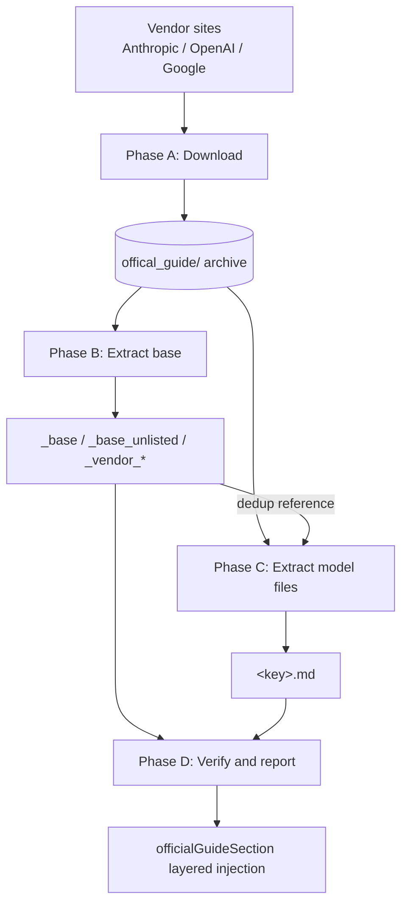

> [!NOTE]
> This README was generated by [SKILL](https://github.com/agenvoy/skill-readme-generate), get the ZH version from [here](./doc/README.zh.md). 
> This skill's implementation was fully agent-generated; the developer only tuned its input/output.

---

<strong>DISTILL VENDOR PROMPTING GUIDES INTO PER-TURN MODEL STEERS!</strong>

---

> A skill with official guide archiving, unified cross-vendor extraction rules, and layered per-turn injection

## Table of Contents

- [Features](#features)
- [Architecture](#architecture)
- [License](#license)

## Features

> `git clone https://github.com/agenvoy/skill-extract-official-guide ~/.claude/skills/extract-official-guide` · [Documentation](./doc/doc.md)

- **Verbatim Source Archive** — Fetches the full markdown guides from Anthropic, OpenAI, and Google with a retrieval date and source URL, and reports failures instead of filling gaps from memory.
- **Unified Cross-Vendor Rules** — Every vendor and model shares one exclusion list, one deletion-reason table, and one line/section budget with no per-vendor exceptions.
- **Layered Injection with Base Split** — Structural, vendor, and model layers stack per turn, while unlisted open models receive a dedicated agentic baseline so frontier models are never steered twice.
- **Traceable Deletions** — Every removed rule must cite the counterpart text it duplicates or conflicts with, and every overwrite of an archive or output requires a diff and explicit approval.
- **Fixed Heading Vocabulary** — Fourteen ordered categories turn cross-file overlap checks from manual comparison into a single grep.

## Architecture

> [Full Architecture](./doc/architecture.md)

## License

This project is licensed under the [MIT LICENSE](LICENSE).
