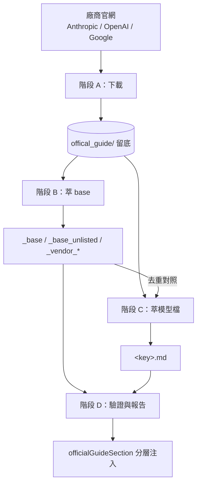

> [!NOTE]
> 此 README 由 [SKILL](https://github.com/agenvoy/skill-readme-generate) 生成，英文版請參閱 [這裡](../README.md)。 
> 此 skill 的實作內容全由 agent 生成，開發者僅針對 input / output 進行調整。

---

<strong>DISTILL VENDOR PROMPTING GUIDES INTO PER-TURN MODEL STEERS!</strong>

---

> Skill，具備官方指引留底、跨廠商統一萃取規範與分層逐輪注入

## 目錄

- [功能特點](#功能特點)
- [架構](#架構)
- [授權](#授權)

## 功能特點

> `git clone https://github.com/agenvoy/skill-extract-official-guide ~/.claude/skills/extract-official-guide` · [完整文件](./doc.zh.md)

- **官方原文留底** — 直接抓 Anthropic、OpenAI、Google 的 markdown 全文並標記取得日期與來源，抓不到就回報失敗，絕不以記憶內容補位。
- **跨廠商統一萃取規範** — 所有廠商、所有型號共用同一份「一律不收」清單、刪除理由表與行數／區塊上限，不因廠商不同而放寬。
- **疊加注入與 base 分岔** — 結構規則、廠商層、型號層三層疊加注入，未列名的開源模型改拿專屬的 agentic 基線，前沿模型不被重複規範。
- **每筆刪除皆可追溯** — 每一條被刪的規則都必須指出對造原文，覆寫留底或產出前一律先出 diff 並取得同意。
- **固定標題字彙** — 14 個固定類別依序排列，讓跨檔案重疊檢查從人工比對變成一行 grep。

## 架構

> [完整架構](./architecture.zh.md)

## 授權

本專案採用 [MIT LICENSE](../LICENSE)。
