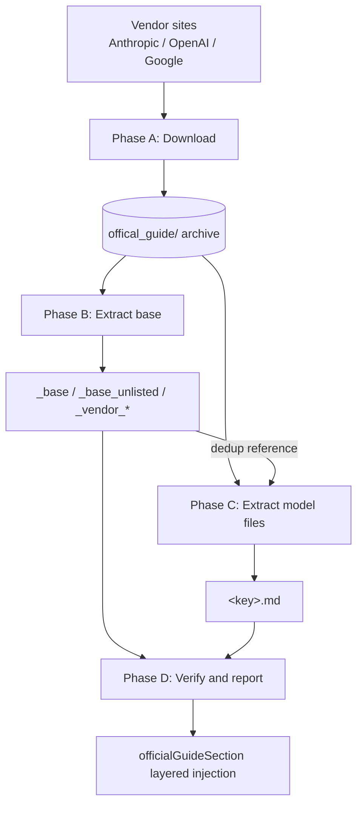
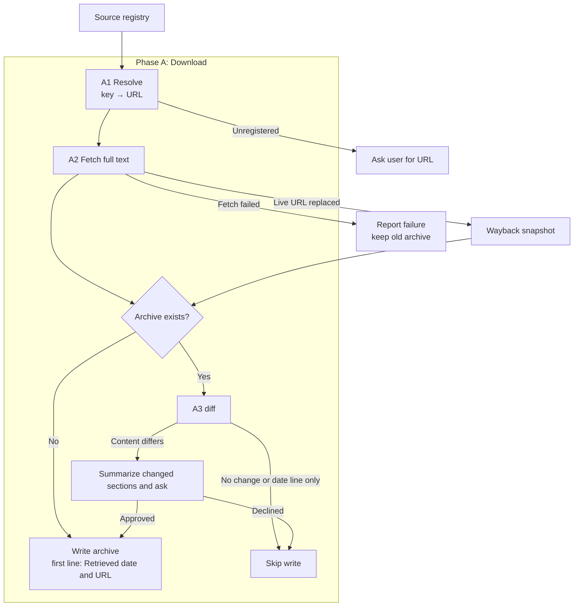
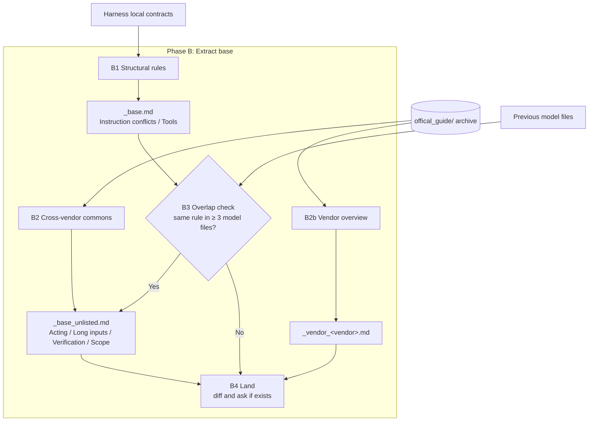
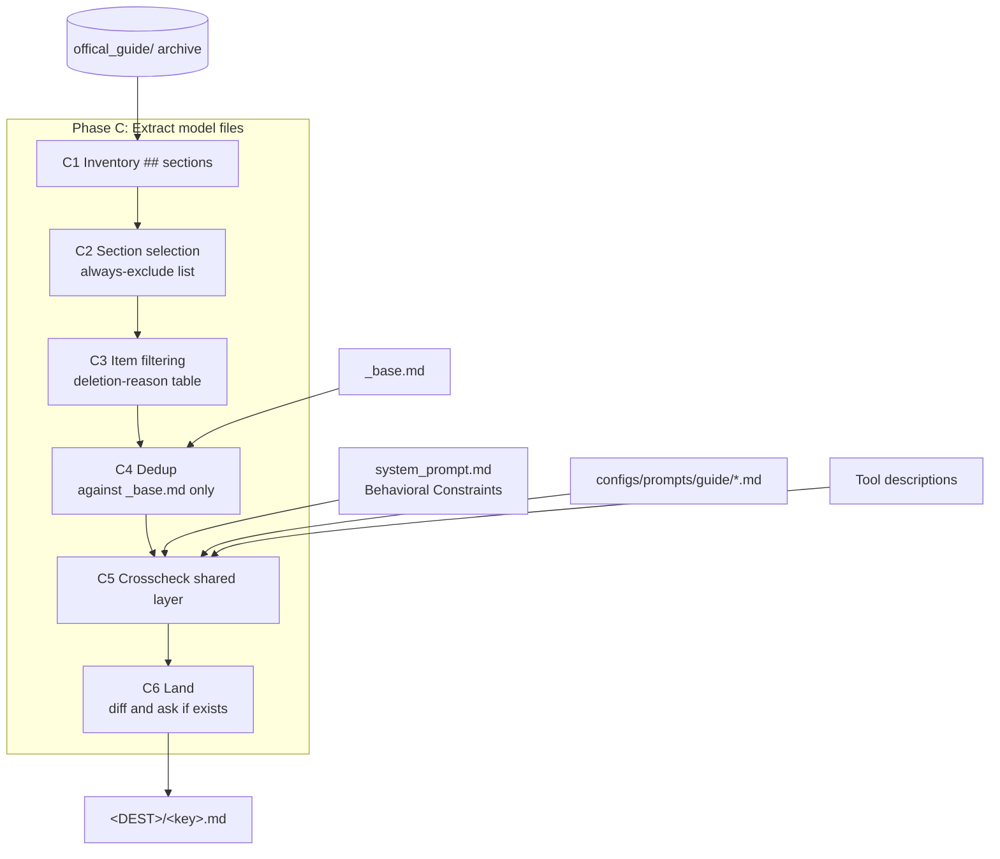
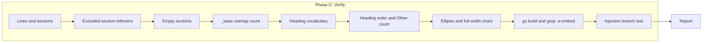
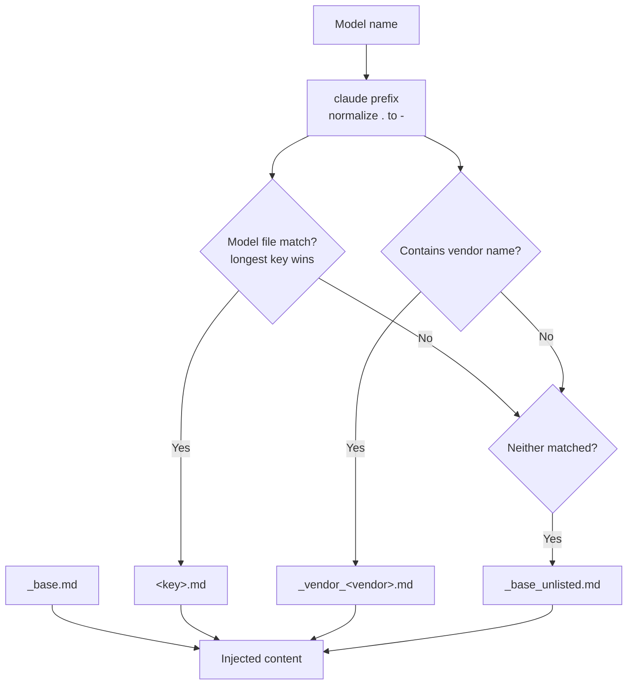
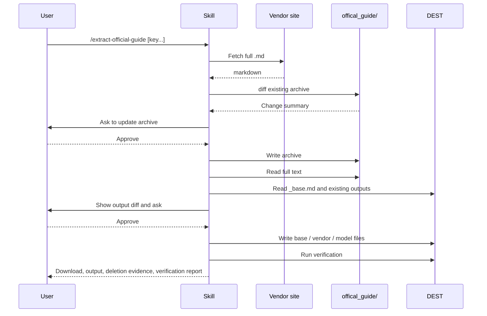
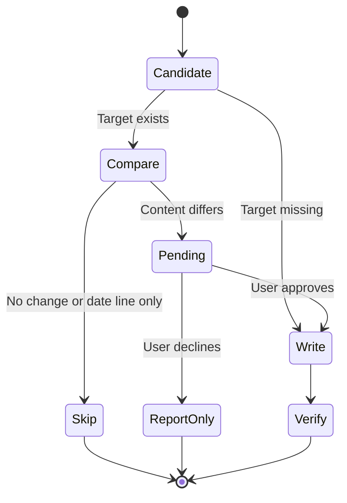

# extract-official-guide - Architecture

> Back to [README](../README.md)

## Overview

## Module: Phase A Download

Resolves keys to official URLs, fetches the full markdown, and reconciles it with the existing archive.

## Module: Phase B Extract Base

Produces the always-injected structural rules, the unlisted-model baseline, and the vendor cross-model layer from distinct sources.

## Module: Phase C Extract Model Files

Reduces each archived guide to the model-specific anti-default corrections, one key at a time.

## Module: Phase D Verify

Runs budget, vocabulary, ordering, overlap, build, and injection-branch checks after writing.

## Module: Layered Injection

`officialGuideSection()` picks one file per layer and stacks them.

## Data Flow

## State Machine

The overwrite gate shared by archives and outputs.

