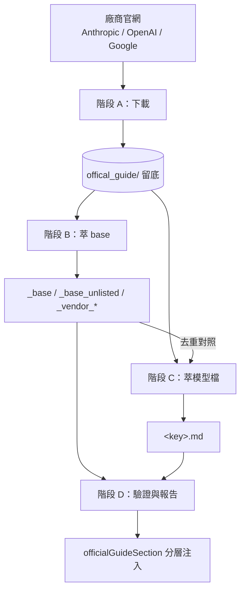
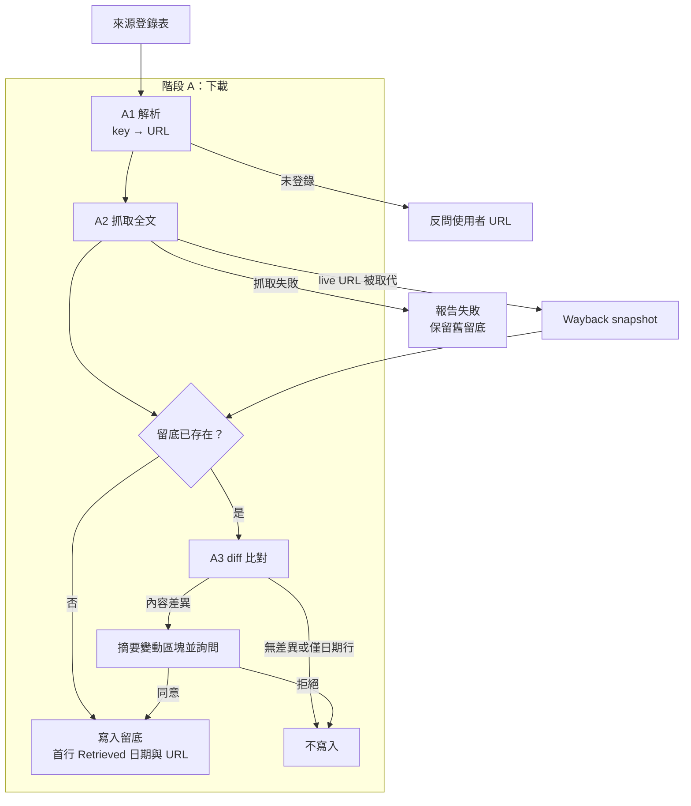
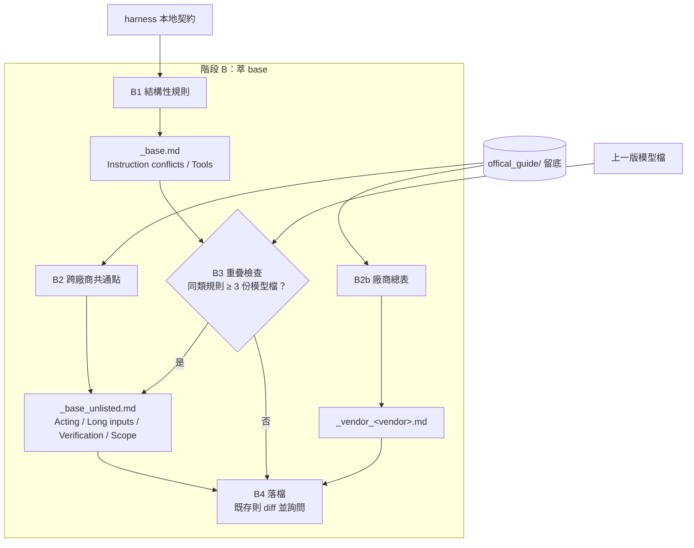
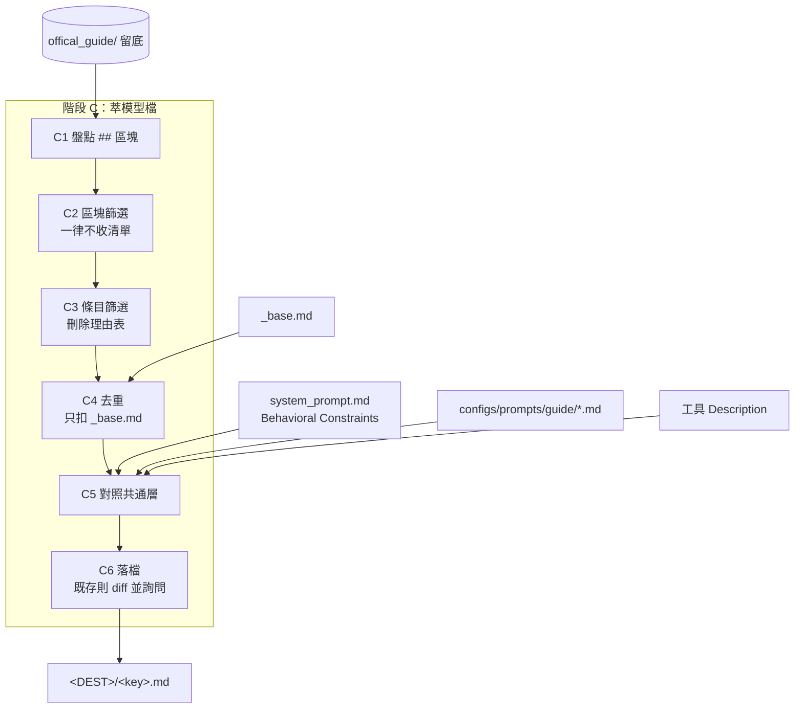
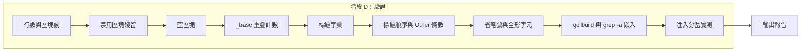
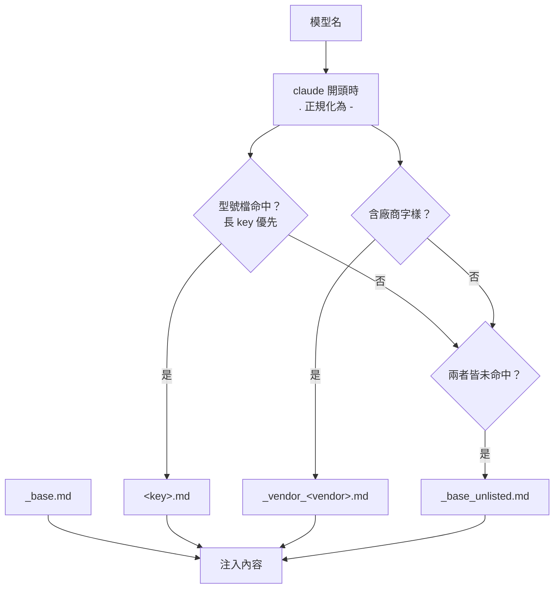
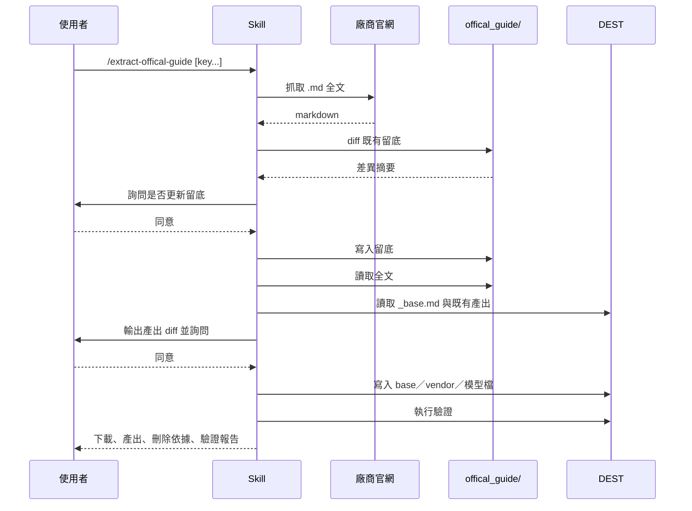
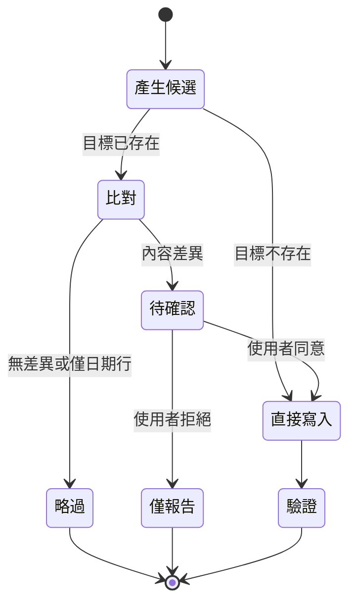

# extract-offical-guide - 架構

> 返回 [README](./README.zh.md)

## 概覽

## Module: 階段 A 下載

將 key 解析為官方 URL，抓取 markdown 全文並與既有留底比對。

## Module: 階段 B 萃 base

依不同來源產出一律注入的結構規則、未列名模型基線與廠商跨型號層。

## Module: 階段 C 萃模型檔

逐 key 將留底全文刪減為型號專屬的反預設修正。

## Module: 階段 D 驗證

寫入後實跑篇幅、字彙、順序、重疊、build 與注入分岔檢查。

## Module: 分層注入

`officialGuideSection()` 每層各挑一份疊加注入。

## 資料流

## 狀態機

留底與產出檔共用的覆寫閘門。

